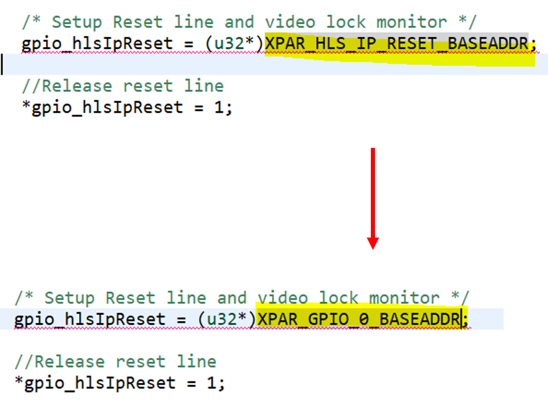

# ZC702 Video Mixer Output Flow
+ This article mainly explains how to use the official demo to output Video Mixer via ADV7511 HDMI on ZC702

**Last update: 2024/05/18**

+ Vivado Version: 2021.1

+ Vivado 2020.1, 2020.2, and 2021.1 have known bugs related to image processing IPs such as VPSS, Video Mixer, and Video Multi-Scaler, which may cause issues during synthesis. You can refer to the following link for troubleshooting:

[Vivado HLS - 2021.1 - Why does synthesis stall when using Windows OS?](https://support.xilinx.com/s/article/Patch-AR-for-HLS-IP-patch?language=en_US)

### 0. After downloading the zip file from the above link, extract it to the C drive. Then, add an environment variable and restart Vivado to resolve the issue

## Build ZC702 Block Design on Vivado

### 1. Refer to the ZC702 HDMI Block Design, and add Video Mixer and two GPIOs

+ ZYNQ7 Processing System

+ Video Test Pattern Generator

+ AXI4-Stream to Video Out

+ Video Timing Controller

+ Clocking Wizard

+ AXI IIC

+ AXI4-Stream Subset Converter

+ GPIO-0

+ GPIO-1

+ Video Mixer

+ AXI Interconnect

+ Connect the above IPs – do not connect 'sof_state_out'

Run Connection Automation – Select 148 MHz for all Clock Sources

### 2. Add the XDC content, which can be downloaded from this [link](https://support.xilinx.com/s/feed/0D52E00007IPcI2SAL?language=en_US)

Alternatively, you can find the file in 'XVES_0019\src\constr\ZC702.xdc'

Remember, the HDMI output port must match the port names specified in the XDC file

Modify the XDC content

### 3. Create HDL Wrapper & Generate Bitstream

### 4. This step will export the XSA to Vitis for writing C code to control the FPGA

## Build ZC702 Application on Vitis

### 5. Open Vitis and import the XSA to create the Platform

+ After creating the Platform, proceed with the Build to generate the linking files

### 6. Select BSP and create an Application using the official Video Mixer Example Code provided

### 7. Import the previously written code for ZC702 HDMI to write to the ADI HDMI Chip

### 8. Open 'xv_mix_example.c' and add the following code snippets

+ main function

+ The build has an error because the GPIO names do not match Vivado. They need to be changed

### 9. Right-click on the application and select "Run as" -> "1 Launch Hardware" to view the results

+ ZC702 Hardware Configuration

+ Result

